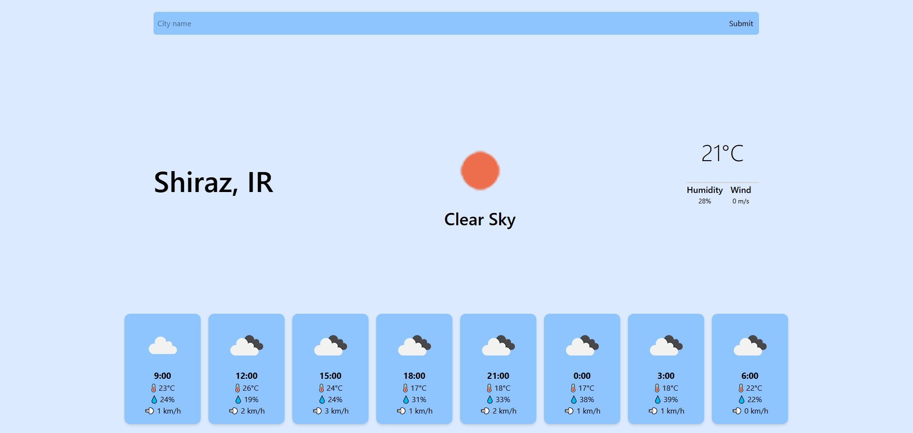
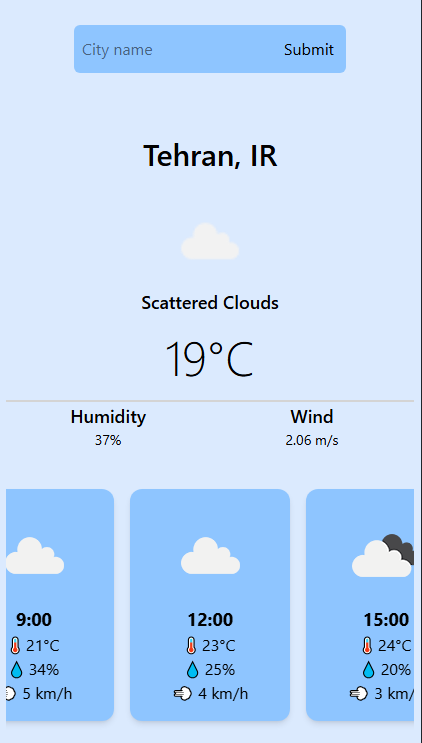

# 🌤️ Weather App

A sleek and responsive weather forecast app that shows the **current weather** and a **24-hour forecast** using OpenWeatherMap API.  
Built with React, Tailwind CSS, and custom hooks – just plug in a city and get all the info you need! 🏙️

## 🔗 Live Demo

👉 [Click here to view the live app](https://weather-app-v2-teal.vercel.app/)  
---

## 🚀 Features

- 🔍 Search weather by city name
- 🌡️ Shows temperature, humidity, wind, and weather icon
- 🕒 Scrollable 24-hour forecast slider (drag or swipe)
- 📱 Fully responsive (mobile & desktop)
- 😅 Friendly error handling for empty input or API errors
- 💨 Real-time updates with smooth UI

---

## 🛠 Tech Stack

| Tool         | Usage                           |
|--------------|----------------------------------|
| **React**    | Core framework                   |
| **Tailwind CSS** | Styling with utility classes   |
| **useState & useRef** | State and input handling      |
| **Custom Hooks** | `useFetch` for reusable data fetching |
| **.env**     | Securely storing API key         |

---

## 🧠 How It Works

1. User enters a city name
2. App fetches **current weather** and **hourly forecast**
3. Data is shown in beautiful weather cards and sliders
4. Errors or missing input are handled gracefully

---

## 📦 Setup Instructions

```bash
# 1. Clone the repo
git clone https://github.com/your-username/weather-app.git

# 2. Install dependencies
npm install

# 3. Create .env file
touch .env
# 4. Add your API key in .env file
VITE_API_KEY=your_openweathermap_api_key_here

# 5. Run the App
npm run dev
```

## screenshots 


### 📱 Mobile View


## 🤝 Credits
Made with ❤️ by Mohammad
With support from Jomong the cat 🐱